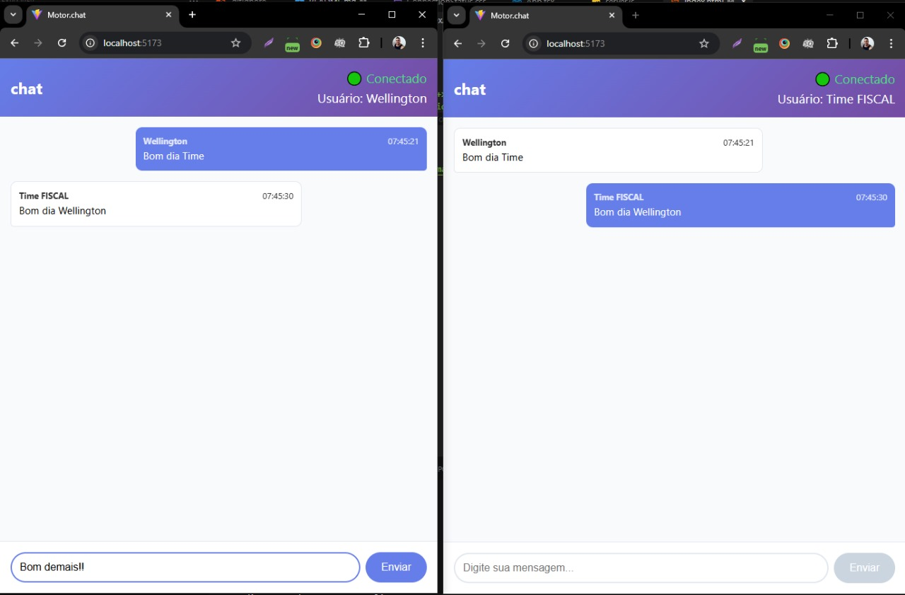

# Motor.chat



## 🚀 Instalação

Execute os seguintes comandos **dentro de cada pasta**:

### Frontend (`motor.chat-frontend-develop`)

```bash
cd motor.chat-frontend-develop
npm install
npm run dev
```

```bash
### Backend (`motor.chat-backend-develop`)


cd motor.chat.backend-develop
npm install
npm run dev
```